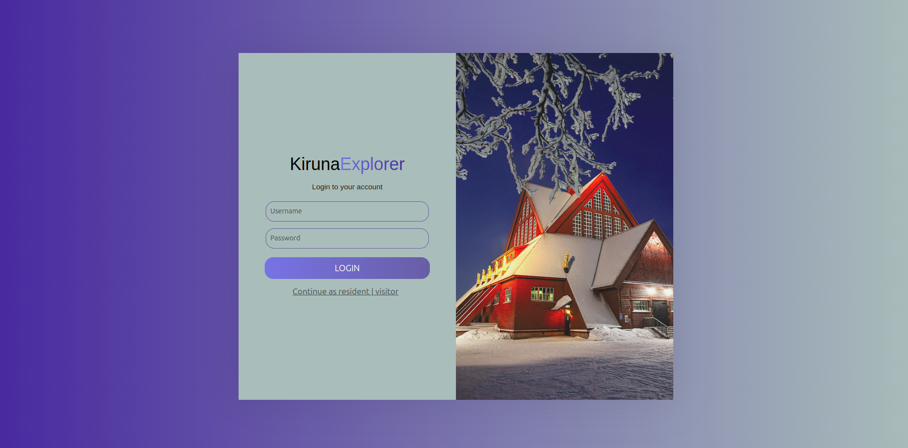
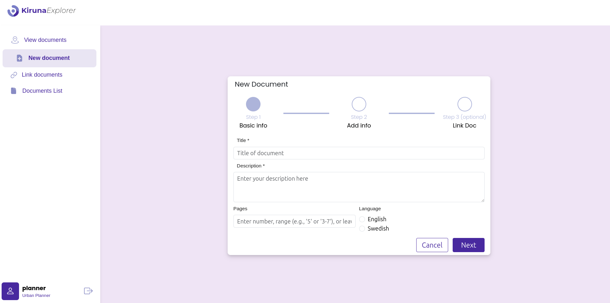

# Table of Contents
- [Kiruna-Explorer](#kiruna-explorer)
- [Getting Started](#getting-started)
- [Technical Debt Management](#technical-debt-management)
- [Features](#features)
- [UI Application screenshots-first release](#ui-application-screenshots)
- [Diagrams](./assets/diagrams/)
  - [Usecase Diagram](./assets/diagrams/UsecaseDiagram.jpeg)
  - [Class Diagram](./assets/diagrams/ClassDiagramR1.jpeg)
- [Retrospectives](./Retrospectives/)
  - [Sprint 1](./Retrospectives/Retrospective_sprint-1.md)
  - [Sprint 2](./Retrospectives/Retrospective_sprint-2.md)

# Kiruna Explorer

Kiruna Explorer is a web application designed to help urban planners, residents, and visitors explore, analyze, and understand documents related to urban planning and geographical information in the Kiruna region. The application offers tools to visualize, link, and interact with various documents on both maps and diagrams, supporting a deeper study of their relationships, geolocation, and impact over time.

## Getting Started

### Prerequisites

Make sure you have the following installed on your machine:

- [Node.js](https://nodejs.org/) (version 14 or higher)

If you are using docker environment, please make sure that you have the following installed, also:

- [Docker](https://www.docker.com/get-started)

### Running the Application (local machine)

1. **Clone the repository**:
   ```sh
   git clone https://github.com/SE2-Team-3/polito-se2-24-03-kiruna-explorer.git
   cd polito-se2-24-03-kiruna-explorer
   ```
2. **Run the client-side server**:
   ```
   cd code/client/
   npm run dev
   ```
3. **Run the server-side server**:
   ```
   cd code/server/
   npm start
   ```

### Running the Application (Docker environment)

1. **Clone the repository**:
   ```sh
   git clone https://github.com/SE2-Team-3/polito-se2-24-03-kiruna-explorer.git
   cd polito-se2-24-03-kiruna-explorer
   ```
2. **Run the container**:
   ```
   docker-compose up --build
   ```
   Happy coding!


## Technical Debt Management

### Team TD Strategies

1. Start the sprint with general tasks, mostly related to fixes from the previous sprint, to ensure system persistence and avoid possible bugs.
2. Assign the fixes to the developers who were in charge of them in the previous sprint to increase team performance and prevent maintainability issues.
3. Split the mockup tasks into multiple parts based on defined User Stories to be available for target User Stories and avoid any blockers for the development team.
4. Dedicate styling meetings to avoid possible bugs in the UI/UX for each User Story.
5. Create a Pull Request after developing any feature/documentation in the project to analyze the changes precisely and provide feedback within the team.
6. Perform code reviews to find possible bugs, maintainability and security issues, or apply any necessary refactoring, and report them to be fixed before merging.
7. Perform E2E testing after code review for each User Story to find essential bugs and issues in the system and report them to be fixed in a dedicated PR.
8. Identify common features between User Stories to make technical decisions that allow multiple team members to work in parallel on different User Stories without blocking each other, thereby increasing the overall performance of the team.

### SonarQuebe Rules
1. Code smell (maintainability domain)
2. Bug (reliability domain)
3. Vulnerability (security domain)
4. Security hotspot (security domain)


## Features

### Document Management

- ### Add New Document Descriptions:
  Urban planners can add standardized document descriptions with predefined fields.
- ### Link Documents:
  Users can link documents to each other, establishing relationships defined by different link types, as outlined in the documentation.
- ### Georeference Documents:
  Documents can be georeferenced on a map, either during insertion or adjusted later, using coordinates or referencing the municipal area.
- ### Add Original Resources and Attachments:
  Urban planners can upload additional resources or attachments to documents, such as maps, text documents, photos, and videos, to provide comprehensive context.

### Document Visualization and Interaction on Maps

- ### View Documents on the Map:
  Urban planners, residents, and visitors can visualize documents on the map, allowing for an overview of their spatial relationships to areas of interest.
- ### Define and Adjust Document Geolocation:
  Urban planners can define or refine the exact geolocation of documents to ensure accuracy in spatial representation.
- ### Select and Interact with Documents:
  Users can click on documents displayed on the map to access further details and the document itself.
- ### Filter Documents on the Map:
  Users can filter the displayed documents based on project-defined filter types to focus on relevant data.

### Document Visualization and Interaction on Diagrams

- ### Visualize Document Relationships Over Time:
  Users can visualize documents on a timeline, studying their temporal relationships and evolution over time.
- ### Adjust Document Positions and Connections on Diagram:
  Urban planners can refine the layout and connections of documents on the diagram to improve readability and reflect updated relationships.
- ### Click on and Access Documents via Diagram:
  Users can click on diagram entries to access documents, promoting easy exploration.
- ### Filter Diagram Contents:
  The diagram can be filtered by document type, helping users focus on specific information.

### Cross-Platform Document Navigation

- ### Map-to-Diagram Linking:
  Selecting a document on the map automatically highlights it in the diagram.
- ### Diagram-to-Map Linking:
  Users can select a document in the diagram, which will show its position on the map, facilitating seamless navigation between views.


# **UI Application screenshots** 
### Login page

### Add document page

### Georeference document on map


# License

Kiruna Explorer is licensed under the [GNU GPL v3.0 License](LICENSE). Under this license, you are free to use, modify, and distribute this software, provided any derivative works are also licensed under the GPL.
